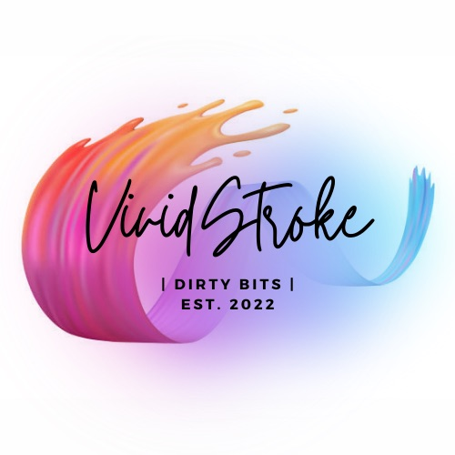

# VividStroke

## Digital Art Website
Team Project 3
  

## Description 📖 
Our Digital Art Website allows you to browse and shop for some of the best digital art from around the globe. Our team handpicks each artist to be featured on our website to bring you digital art of the highest quality. Create an account with us and sign in to purchase that piece that we know catches your eye! 

## Table of Contents 
1. [Installation](#installation)
2. [Built With](#built-with)
3. [Usage](#usage)
4. [Credits](#credits)
5. [License](#license)
6. [Contribution](#contribution)
7. [Visual](#visual)
8. [Questions](#questions)

## Installation 
💾
 

## Built With
* HTML
* CSS
* JavaScript
* MongoDB
* Mongoose
* ExpressJS
* ReactJS
* MUI

## Usage 
🧰

## Credits
🏆
 
* [MUI](https://mui.com/) "The React UI library you always wanted"
* [YouTube Tutorial](https://www.youtube.com/watch?v=y66RgYMAgSo)
* [Justin Peters](https://www.instagram.com/jstnptrs/?hl=en)
* [Cyril Rolando](https://www.curioos.com/aquasixio)
* [Ten Hundred](https://www.instagram.com/tenhun/?hl=en)

## License 

This project is covered by the [MIT](https://choosealicense.com/) license.

## Contribution
🤝
 
* [Chase Harvey](https://github.com/ObeeK)
* [Seth Hixon](https://github.com/Sethhixon92)
* [J Taylor Allen](https://github.com/jtaylorallen)
* [Marisol Ramirez](https://github.com/MarisolRamirez1031)
* [Paul Barcenas](https://github.com/pab12)
* [Jared Dodson](https://github.com/jareddodson)

#### Honorable Mentions
* [Google](https://www.google.com/)
* [Stack Overflow](https://stackoverflow.com/)

## Visual

## Questions
❓
 
Github: [DirtyBitss](https://github.com/DirtyBitss)
 
Email: vividstroke@dirtybitss.com
 
If you have any questions you can reach us via email or our GitHub account.

##### ©️2022 Dirty Bits, Inc.
